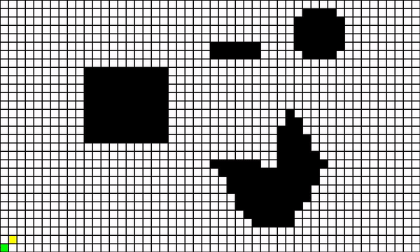
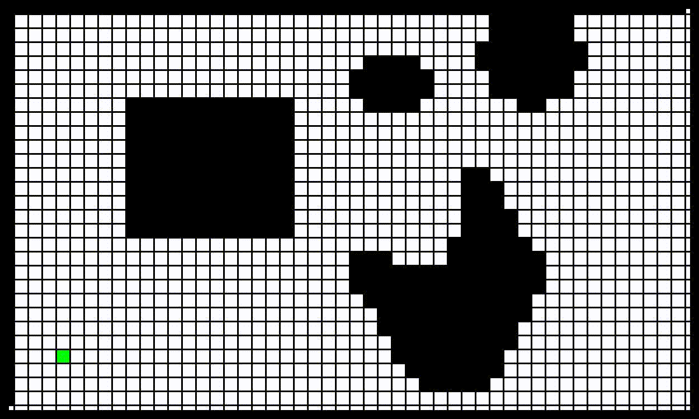

# A Star and Dijkstra
  A Star and Dijkstra algorithms are implemented for point robot and rigid circular robot. The obstacle space is defined using half plane equation. For rigid robot is updated with Minskowski sum.

## Result
### A Star in Point robot
  

### Dijkstra in rigid robot

## Run Instruction
There are four main scripts.
  1. Dijkstra_point.py
  2. AStar_point.py
  3. Dijkstra_Rigid.py
  4. AStar_Rigid.py

Instruction for Point robot:

1. Run any of the first two of the above mentioned script.
2. Enter the positive integer input for resolution. 1 for original size.
   Grid size is defined as (Original Size)/resolution.
3. Enter the X Y coordinates of start and end points where (1,1) represents bottom-left cell of the
   occupancy grid.
4. If the input for start and goal points are wrongly entered, it prompts user to re-enter it again.

Instruction for Rigid robot:

1. Run any of the last two of above mentioned script.
2. Enter the positive integer input for resolution. 1 for original size.
   Grid size is defined as (Original Size)/resolution.
3. Enter the non negative integer for Radius
4. Enter the non negative integer for Clearance
5. Enter the X Y coordinates of start and end points where (1,1) represents bottom-left cell of the
   occupancy grid.
6. If the input for start and goal points are wrongly entered, it prompts user to re-enter it again.
